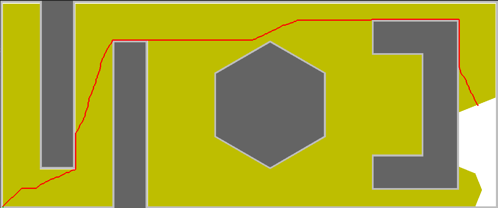
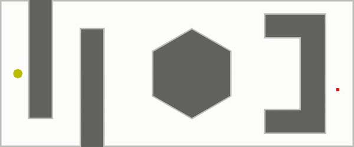
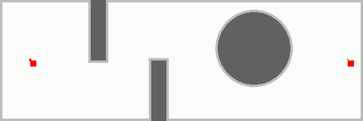
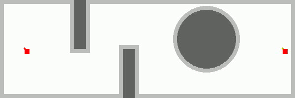

# Path Planning Algorithms for Point Robot: Dijkstra, Bi-RRT, and Bi-RRT*



## Table of Contents
- [Overview](#overview)
- [Features](#features)
- [Architecture](#architecture)
- [Installation](#installation)
  - [Prerequisites](#prerequisites)
  - [Setup Instructions](#setup-instructions)
- [Usage](#usage)
  - [Dijkstra's Algorithm](#dijkstras-algorithm)
  - [Bi-RRT](#bi-rrt)
  - [Bi-RRT*](#bi-rrt-star)
- [Methodology](#methodology)
  - [Dijkstra's Algorithm](#dijkstras-algorithm-methodology)
  - [Bi-RRT](#bi-rrt-methodology)
  - [Bi-RRT*](#bi-rrt-star-methodology)
- [Results](#results)
- [Configuration](#configuration)
- [Troubleshooting](#troubleshooting)
- [Contributing](#contributing)
- [License](#license)
- [Acknowledgements](#acknowledgements)

## Overview

This repository contains implementations of three fundamental path planning algorithms—**Dijkstra's Algorithm**, **Bi-RRT (Bidirectional Rapidly-exploring Random Tree)**, and **Bi-RRT\***—applied to a point robot navigating in a 2D environment with obstacles. Each algorithm is implemented in Python and utilizes Pygame for visualization and OpenCV for video generation.

## Features

- **Dijkstra's Algorithm**: Computes the shortest path from start to goal using a uniform cost search.
- **Bi-RRT**: Explores the space bidirectionally to efficiently find a feasible path.
- **Bi-RRT\***: An optimized version of Bi-RRT that ensures path optimality through rewiring.
- **Visualization**: Real-time visualization of the exploration process and the final path using Pygame.
- **Video Generation**: Converts the exploration and path-finding process into video format using OpenCV.
- **Obstacle Handling**: Supports complex obstacles including rectangles, hexagons, and custom blocks with clearance considerations.


## Installation

### Prerequisites

- **Operating System**: Windows, macOS, or Linux
- **Python**: Version 3.6 or higher
- **Pip**: Python package installer

### Setup Instructions

1. **Clone the Repository**

    ```bash
    git clone https://github.com/MayankD409/Optimal_Path_Planning.git
    cd Optimal_Path_Planning
    ```

2. **Create a Virtual Environment (Optional but Recommended)**

    ```bash
    python3 -m venv venv
    source venv/bin/activate  # On Windows: venv\Scripts\activate
    ```

3. **Install Dependencies**

    ```bash
    pip install -r requirements.txt
    ```

    **`requirements.txt`**:

    ```text
    pygame
    numpy
    opencv-python
    ```

## Usage

Each algorithm is contained within its respective directory. Below are the instructions to run each planner.

### Dijkstra's Algorithm

1. **Navigate to the Dijkstra Directory**

    ```bash
    cd Dijkstra
    ```

2. **Run the Planner**

    ```bash
    python djikstra.py
    ```

3. **Input Coordinates**

    - **Start Point**: Enter the X and Y coordinates when prompted.
    - **Goal Point**: Enter the X and Y coordinates when prompted.

4. **Visualization and Video Generation**

    - The algorithm will visualize the exploration and path in a Pygame window.
    - Upon completion, a video (`output_video.mp4`) will be generated in the `Dijkstra/frames` directory.

### Bi-RRT

1. **Navigate to the Bi-RRT Directory**

    ```bash
    cd ../Bi-RRT
    ```

2. **Run the Planner**

    ```bash
    python bi_rrt.py
    ```

3. **Input Coordinates**

    - **Start Point**: Enter the X and Y coordinates when prompted.
    - **Goal Point**: Enter the X and Y coordinates when prompted.

4. **Visualization and Video Generation**

    - The algorithm will visualize the exploration and path in a Pygame window.
    - Upon completion, a video (`bi_rrt.mp4`) will be generated in the `Bi-RRT/bi_rrt_frames` directory.

### Bi-RRT\*

1. **Navigate to the Bi-RRT\* Directory**

    ```bash
    cd ../Bi-RRT-Star
    ```

2. **Run the Planner**

    ```bash
    python bi_rrt_star.py
    ```

3. **Input Coordinates**

    - **Start Point**: Enter the X and Y coordinates when prompted.
    - **Goal Point**: Enter the X and Y coordinates when prompted.

4. **Visualization and Video Generation**

    - The algorithm will visualize the exploration and path in a Pygame window.
    - Upon completion, a video (`bi_rrt_star.mp4`) will be generated in the `Bi-RRT-Star/bi_rrt_star_frames` directory.

## Methodology

### Dijkstra's Algorithm Methodology

Dijkstra's Algorithm is a classic graph search algorithm that finds the shortest path between nodes in a graph. In this implementation:

1. **Node Representation**: Each node represents a grid cell with x and y coordinates, cost from the start, and a reference to its parent node.
2. **Action Set**: The robot can move in eight possible directions (up, down, left, right, and the four diagonals) with associated movement costs.
3. **Obstacle Handling**: The configuration space includes obstacles with clearance considerations to ensure the robot maintains a safe distance.
4. **Pathfinding**: Utilizes a priority queue to explore nodes with the least cumulative cost first, ensuring the shortest path is found.

### Bi-RRT Methodology

Bidirectional Rapidly-exploring Random Tree (Bi-RRT) is an efficient path planning algorithm that grows two trees simultaneously—one from the start and one from the goal.

1. **Tree Growth**: Alternately extends the start and goal trees towards randomly sampled points.
2. **Connection**: Attempts to connect the two trees when they come within a predefined step size.
3. **Collision Checking**: Ensures that new nodes and paths do not intersect with obstacles.
4. **Path Extraction**: Once the trees are connected, backtracks from the connection point to both the start and goal to form the complete path.

### Bi-RRT\* Methodology

Bi-RRT\* is an optimized version of Bi-RRT that not only finds a feasible path but also optimizes it for lower cost.

1. **Tree Growth and Rewiring**: Similar to Bi-RRT, but additionally considers nearby nodes for potential rewiring to reduce path cost.
2. **Optimal Pathfinding**: Continuously refines the path by selecting parents that offer lower cumulative costs.
3. **Collision-Free Assurance**: Maintains collision-free trees throughout the optimization process.
4. **Path Extraction**: Extracts the optimized path upon successful connection of the trees.

## Results

### Dijkstra's Algorithm



- **Description**: Visual representation of Dijkstra's exploration and the shortest path found from start to goal.

### Bi-RRT



- **Description**: Demonstrates the bidirectional growth of RRT trees and the feasible path discovery.

### Bi-RRT\*



- **Description**: Showcases the optimized path planning with Bi-RRT\* and the rewiring process for cost minimization.

## Configuration

### Planner Parameters

Each planner allows customization through various parameters to suit different environments and requirements.

- **Step Size**: Determines how far the tree extends towards a sampled point in each iteration.
- **Robot Radius and Clearance**: Ensures the robot maintains a safe distance from obstacles.
- **Maximum Iterations**: Limits the number of iterations to prevent infinite loops in complex environments.

These parameters can be adjusted within each script to experiment with different planning behaviors.

### Robot Configuration

- **Point Robot**: Assumes a point-sized robot for simplicity in collision checking.
- **Environment Dimensions**: The scripts are configured for a 600x200 grid space. Modify `width` and `height` in the scripts to change the environment size.

## Troubleshooting

- **No Path Found**:
  - Ensure that the start and goal points are not within obstacles.
  - Adjust the clearance and robot radius if the environment is densely populated with obstacles.
  - Increase the number of iterations for more extensive exploration.

- **Performance Issues**:
  - Reduce the environment size or increase the step size to decrease computation time.
  - Optimize the code by minimizing redundant calculations or using more efficient data structures.

- **Visualization Errors**:
  - Ensure that Pygame is properly installed and functioning.
  - Verify that the frames directory exists and has the necessary write permissions.

- **Video Generation Problems**:
  - Check that all frames are correctly saved before attempting to create the video.
  - Ensure that OpenCV supports the video codec used (`mp4v` in this case).

## License

This project is licensed under the [MIT License](LICENSE).

## Acknowledgements

- **Pygame Community**: For providing a simple yet powerful library for game development and visualization.
- **OpenCV Contributors**: For the comprehensive computer vision library facilitating video generation.
- **Academic Resources**: For foundational knowledge on path planning algorithms.

---

*Happy Path Planning!*

